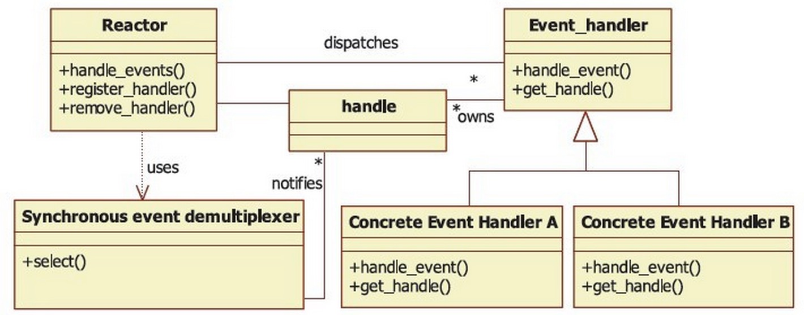
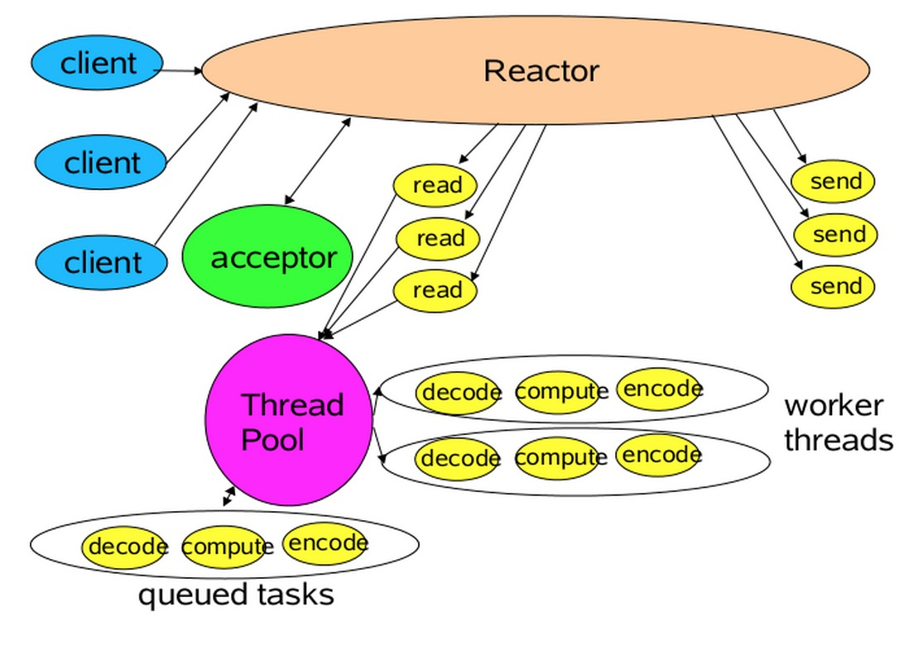

# 3.1 reactor反应堆模式

对每一个构架模式的分析，我们都使用参考文献的分析风格，着重分析意图、上下文、问题、解决方案、结构和实现 6个方面的内容。

##1. 意图

在事件驱动的应用中，将一个或多个客户的服务请求分离（demultiplex）和调度（dispatch）给应用程序。

##2. 上下文

在事件驱动的应用中，同步地、有序地处理同时接收的多个服务请求。

##3. 问题

在分布式系统尤其是服务器这一类事件驱动应用中，虽然这些请求最终会被序列化地处理，但是必须时刻准备着处理多个同时到来的服务请求。在实际应用 中，这些请求总是通过一个事件（如CONNECTOR、READ、WRITE等）来表示的。在有序地处理这些服务请求之前，应用程序必须先分离和调度这些 同时到达的事件。为了有效地解决这个问题，我们需要做到以下4方面：

为了提高系统的可测量性和反应时间，应用程序不能长时间阻塞在某个事件源上而停止对其他事件的处理，这样会严重降低对客户端的响应度。
为了提高吞吐量，任何没有必要的上下文切换、同步和CPU之间的数据移动都要避免。
引进新的服务或改良已有的服务都要对既有的事件分离和调度机制带来尽可能小的影响。
大量的应用程序代码需要隐藏在复杂的多线程和同步机制之后。

##4. 解决方案

在一个或多个事件源上等待事件的到来，例如，一个已经连接的Socket描述符就是一个事件源。将事件的分离和调度整合到处理它的服务中，而将分离和调度机制从应用程序对特定事件的处理中分离开，也就是说分离和调度机制与特定的应用程序无关。

具体来说，每个应用程序提供的每个服务都有一个独立的事件处理器与之对应。由事件处理器处理来自事件源的特定类型的事件。每个事件处理器都事先注册 到Reactor管理器中。Reactor管理器使用同步事件分离器在一个或多个事件源中等待事件的发生。当事件发生后，同步事件分离器通知 Reactor管理器，最后由Reactor管理器调度和该事件相关的事件处理器来完成请求的服务。

##5. 结构

在Reactor模式中，有5个关键的参与者。

描述符（handle）：由操作系统提供，用于识别每一个事件，如Socket描述符、文件描述符等。在Linux中，它用一个整数来表示。事件可以来自外部，如来自客户端的连接请求、数据等。事件也可以来自内部，如定时器事件。
同步事件分离器（demultiplexer）：是一个函数，用来等待一个或多个事件的发生。调用者会被阻塞，直到分离器分离的描述符集上有事件发生。Linux的select函数是一个经常被使用的分离器。
事件处理器接口（event handler）：是由一个或多个模板函数组成的接口。这些模板函数描述了和应用程序相关的对某个事件的操作。
具体的事件处理器：是事件处理器接口的实现。它实现了应用程序提供的某个服务。每个具体的事件处理器总和一个描述符相关。它使用描述符来识别事件、识别应用程序提供的服务。
Reactor 管理器（reactor）：定义了一些接口，用于应用程序控制事件调度，以及应用程序注册、删除事件处理器和相关的描述符。它是事件处理器的调度核心。 Reactor管理器使用同步事件分离器来等待事件的发生。一旦事件发生，Reactor管理器先是分离每个事件，然后调度事件处理器，最后调用相关的模 板函数来处理这个事件。
通过上述分析，我们注意到，是Reactor管理器而不是应用程序负责等待事件、分离事件和调度事件。实际上，Reactor管理器并没有被具体的 事件处理器调用，而是管理器调度具体的事件处理器，由事件处理器对发生的事件做出处理。这就是类似Hollywood原则的“反向控制”。应用程序要做的 仅仅是实现一个具体的事件处理器，然后把它注册到Reactor管理器中。接下来的工作由管理器来完成。这些参与者的相互关系如图2-1所示。

现在结合第1章分析的框架五元素来看一下Reactor构架模式的参与者与框架五元素之间的关系：Reactor构架模式的具体实现对应了元素1； 事件处理器接口对应元素2；具体的事件处理器对应元素3；Reactor管理器使用了Hollywood原则，可以认为和元素5对应；元素4的功能相对不 明显，没有明确的对应关系。

如果还是没有理解Reactor构架模式，没有关系，源代码会说明所有问题。此时可再分析一遍Reactor构架模式，然后继续以下内容。

